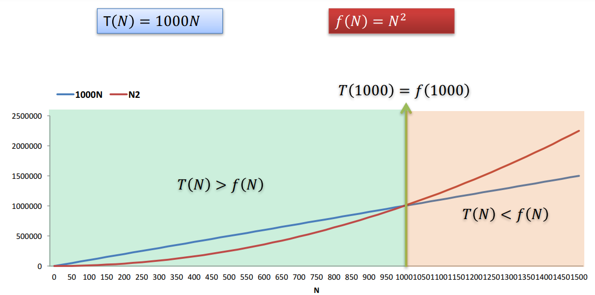
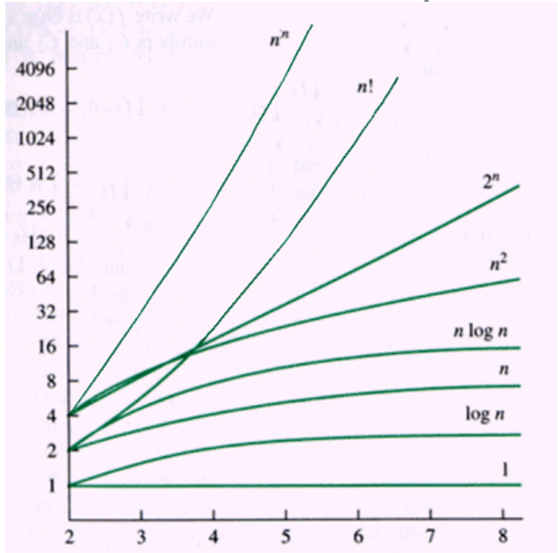

# Análise de Complexidade
Algoritmo: conjunto claramente especificado de instruções definidas para resolver um problema
## Análise de Algoritmos
- Determinar recursos exigidos por um algoritmo (tempo, espaço)
- Comparar os recursos exigidos por diferentes algoritmos que resolvem o mesmo problema (um algoritmo mais eficiente exige menos recursos)
- Prever o crescimento dos recursos exigidos por um algoritmo à medida que o tamanho dos dados de entrada aumenta
## Complexidade Espacial e Temporal
- Complexidade Espacial: quantidade de memória necessária para executar o algoritmo
    - S(n) é o espaço de memória exigido em função do tamanho n da entrada
- Complexidade Temporal: quantidade de tempo necessária para executar o algoritmo
    - T(n) é o tempo de execução em função do tamanho n da entrada
- Complexidade vs Eficiência
## Conceito de Complexidade
É um ramo da matemática computacional que estuda a eficiência dos algoritmos. Para medir a efiência de um algoritmo, frequentemente usamos um tempo teórico que o programa leva para encontrar uma resposta em função dos dados de entrada

### Problema do Caixeiro Viajante
- Dado um conjunto de cidades e as distâncias entre cada par de cidades, o problema do caixeiro viajante (PCV) é encontrar o menor caminho possível que visite cada cidade exatamente uma vez e retorne à cidade de origem
- O problema do caixeiro viajante é um problema de otimização combinatória

## Notação Assintótica
- A notação assintótica é uma notação matemática que descreve o comportamento de uma função quando o seu argumento tende a um valor específico ou ao infinito

Forma de Análise: Taxa de crescimento

Apesar de 1000N ser maior que N² para N pequenos, a taxa de crescimento de N² é maior e ultrapassa 1000N para N>1000. Logo, N² é maior que 1000N.

### Notação O (Big-O)
- A notação O (Big-O) é usada para descrever o comportamento assintótico superior de uma função
- Seja f(n) uma função de complexidade temporal, então O(f(n)) é o conjunto de funções g(n) tais que existem constantes positivas c e n0 tais que 0 ≤ g(n) ≤ cf(n) para todo n ≥ n0
- Há um valor de N ($n_0$) a partir do qual c.f(N) será
sempre, no mínimo, tão grande quanto T(N). 
- Neste caso, dizemos que T(N) = O(f(N)).
    - T(N) é O(f(N)) 
- **Se T(N) = O(f(N)), estamos garantindo que a função T(N) cresce a uma taxa igual ou inferior à f(N)**. Assim, f(N) representa o limite superior de T(N).
### Notação Ω
- A notação Ω é usada para descrever o comportamento assintótico inferior de uma função
- T(N) = Ω(g(N)) se existem constantes positivas c e $n_0$ tais que T(N) ≥ cg(N) para todo N ≥ $n_0$
- **Se T(N) = Ω(g(N)), estamos garantiando que a função T(N) cresce a uma taxa igual ou superior à g(N). Assim, g(N) representa o limite inferior de T(N).**

### Notação Θ
- T(N) = Θ(h(N)) se, e somente se, T(N) = O(h(N)) e T(N) = Ω(h(N))
- **Estamos garantindo que a função T(N) cresce a uma taxa igual à h(N)**
- T(N) = Θ(h(N)) se existem constantes positivas $c_1$, $c_2$ e $n_0$ tais que $c_1$.h(N) ≤ T(N) ≤ $c_2$.h(N) para todo N ≥ $n_0$
### Propriedades
- Se $T_1$(N) = O(f(N)) e $T_2$(N) = O(g(N)), então:
    - $T_1$(N) + $T_2$(N) = O(f(N) + g(N))
    - $T_1$(N) . $T_2$(N) = O(f(N) . g(N))

- Se T(N) é um polinômio de ordem k, então:
    - T(N) = Θ($N^k$)

- $log^kN$ = O(N) para qualquer constante k. Isso indica que logaritmos crescem muito lentamente

### Exemplo
<!--- T(N) = 2N² + 3N + 1
- T(N) = O(N²)-->
- N² = O(N³)
- N³ = Ω(N²)
- F(N) = 2N² + 3N
    - F(N) = O($N^4$) ; 
    - F(N) = O(N³) ; 
    - F(N) = O(N²) ;
    - Colocando: F(N) = Θ(N²)
    - Implica não só que F(N) = O(N²), mas também que N² é a ordem de crescimento que melhor se ajusta ao comportamento assintótico de F(N)
### Cresimentos Típicos

### Observação
As funções n², $\frac{3}{2}$ n², n²+100n pertencem a mesma ordem. Para volores enormes de n, essas funções crescem com a mesma velocidade. Assim, podemos não considerar constantes ou termos de ordens baixas