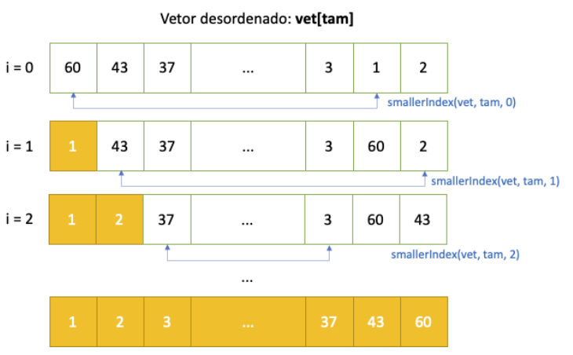
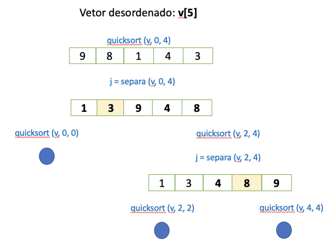
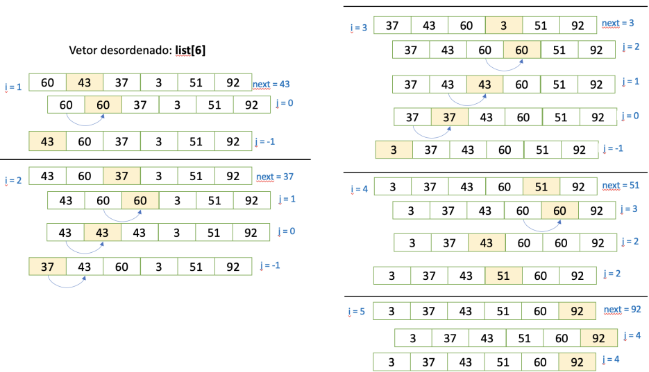
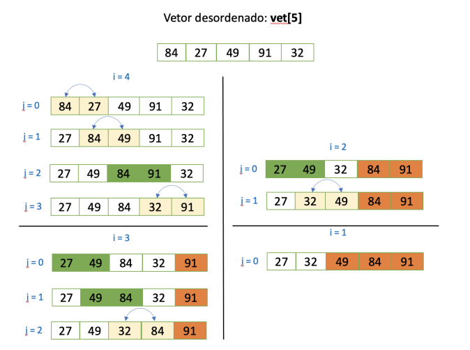
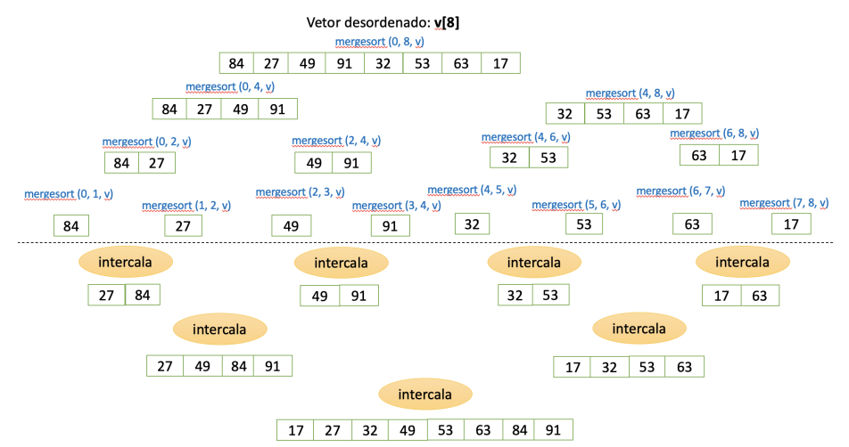

# Ordenação
Encontrar um dado específico em um conjunto ordenado requer menos esforço computacional do que se o conjunto estiver desordenado.

## Selection Sort



```c
int smallerIndex(int vet[], int tam, int ini){
    int min = ini, j;
    for(j=ini+1; j<tam; j++){
        if(vet[min] > vet[j])
            min = j;
    }
    return min;
}

void selectionSort(int vet[], int tam){
    int i, min, aux;
    for(i=0; i<tam; i++){
        //Acha posicao do menor elemento a partir de i:
        min = smallerIndex(vet, tam, i);
        aux = vet[i];
        vet[i] = vet[min];
        vet[min] = aux;
    }
}
```

A complexidade do algoritmo é O(n²) no melhor e pior caso.

## QuickSort
Esse algoritmo é baseado na técnica de divisão e conquista. Ele escolhe um elemento como pivô e particiona o vetor de forma que os elementos menores que o pivô fiquem a sua esquerda e os maiores a sua direita. Em seguida ele ordena as duas partições recursivamente.



```c
// Recebe vetor v[p..r] com p <= r. Rearranja
// os elementos do vetor e devolve j em p..r
// tal que v[p..j-1] <= v[j] < v[j+1..r].
int separa (int v[], int p, int r) {
    int c = v[r]; // pivô
    int t, j = p;
    for (int k = p; k < r; ++k){
        if (v[k] <= c) {
            t = v[j], v[j] = v[k], v[k] = t;
            ++j;
        }
    }
    t = v[j], v[j] = v[r], v[r] = t;
    return j;
}

// Esta função rearranja qualquer vetor
// v[p..r] em ordem crescente. 

void quicksort (int v[], int p, int r){
    if (p < r) {
        int j = separa (v, p, r);
        quicksort (v, p, j-1);
        quicksort (v, j+1, r);
    }
}
```

- A complexidade do algoritmo é O(n log n) no melhor caso e O(n²) no pior caso (quando o vetor já está ordenado ou quase - casos raros).
- A escolha do pivô afeta a complexidade
- Não altera a ordem de chaves iguais
- Recursivo

## Insertion Sort

Esse algoritmo percorre o vetor da esquerda para a direita e à medida que avança vai deixando os elementos mais à esquerda ordenados. Em algumas aplicações, há um vetor de entrada e um vetor de saída. O vetor de saída é inicialmente vazio e os elementos do vetor de entrada são inseridos um a um, em ordem, no vetor de saída.


> Essa solução está usando apenas um vetor.

```c
void insertionSort(int list[], int n){
    int i, j;
    int next;
    for (i=1; i<n; i++) {
        next= list[i];
        for (j=i-1; j>=0 && next<list[j];j--)
            list[j+1] = list[j];
        list[j+1] = next;
    }
}
```

A complexidade do algoritmo é O(n) no melhor e O(n²) pior caso.

## Bubble Sort

Esse algoritmo percorre o vetor diversas vezes, e a cada passagem faz trocas de elementos adjacentes se eles estiverem na ordem errada. Esse algoritmo vai diminuindo o espaço de busca a cada passagem. Pouco eficiente.



```c
void bubbleSort(int vet[], int tam){
    int i,j, temp;
    for(i=tam-1; i>0; i--){
        for(j=0; j < i; j++) //Faz trocas até posição i
            if( vet[j] > vet[j+1] ){
                temp = vet[j];
                vet[j] = vet[j+1];
                vet[j+1] = temp;
            }
    }
}
// esse código está faltando uma parte para ficar completo: um break caso não tenha entrado no if
```

```c
// Algoritmo corrigido
void bubbleSort(int vet[], int tam){
    int i,j, temp, trocou;
    for(i=tam-1; i>0; i--){
        trocou = 0;
        for(j=0; j < i; j++) //Faz trocas até posição i
            if( vet[j] > vet[j+1] ){
                temp = vet[j];
                vet[j] = vet[j+1];
                vet[j+1] = temp;
                trocou = 1;
            }
        if(trocou == 0) break;
    }
}
```

A complexidade do algoritmo é O(n) no melhor caso e O(n²) no pior caso.

## Merge Sort



```c
// A função recebe vetores crescentes v[p..q-1] e v[q..r-1]
// e rearranja v[p..r-1] em ordem crescente.
void intercala (int p, int q, int r, int v[]){
    int *w;
    w = malloc ((r-p) * sizeof (int));
    int i = p, j = q;
    int k = 0;

    while (i < q && j < r) {
        if (v[i] <= v[j]) w[k++] = v[i++];
        else w[k++] = v[j++];
    }
    while (i < q) w[k++] = v[i++];
    while (j < r) w[k++] = v[j++];
    for (i = p; i < r; ++i) v[i] = w[i-p];
    free (w);
}

// A função mergesort rearranja o vetor
// v[p..r-1] em ordem crescente.

void mergesort (int p, int r, int v[]){
    if (p < r-1) {
        int q = (p + r)/2;
        mergesort (p, q, v);
        mergesort (q, r, v);
        intercala (p, q, r, v);
    }
}

```

- A complexidade é O(n log n) no melhor e pior caso.
- Não altera a ordem de chaves iguais
- Recursivo
- Usa um vetor temporário durante a ordenação

# Exercício

Ordenar a coluna População 2010 do arquivo [listaMunicipios.csv](../6_algoritmos_buscas/listaMunicipios.csv) de forma decrescente e apresentar o tempo de execução dos métodos de ordenação