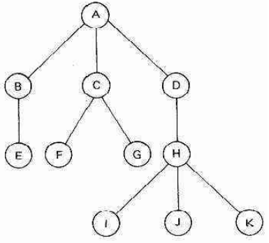
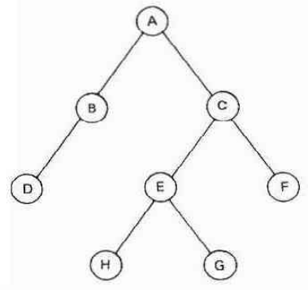
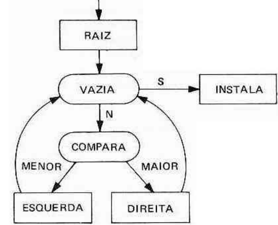

Relação de hierarquia

# Árvore

Uma árvore é uma conjunto finito T de um ou mais nós, tais que:
- Existe um nó raiz R
- Os demais nós formam m $\ge$ 0 conjuntos disjuntos $S_1$, ..., $S_m$ onde cada elemento é uma subárvore de R
- Um nó possui:
    - Grau: quantidade de filhos (subárvores)
    - Nível: "distância" relativa da raiz
- Uma árvore possui altura, definido como o nível mais alto
- Se um nó não tiver filhos, tiver grau zero, então esse nó se chama nó folha ou nó terminal
- Nó filho: : As raízes das subárvores de um nó P são ditos nós filhos de P
- Nó irmão: filhos de um mesmo nó P
- Um conjunto de árvores disjuntas chama-se Floresta



# Árvore Binária

São estruturas do tipo árvore, onde o grau de cada nó é menor ou igual a dois

Os nós filhos (subárvores) são divididos entre filhos da esquerda e filhos da direita.

Se o grau de um nó é igual a 1, deve-se especificar se sua subárvore é a da esquerda ou da direita.



## Implementação

Existe a representação estática em vetores, que dificulta manipulação, e é indicada apenas para o armazenamento permanente.

Sendo assim, a forma ideial de implementação é com alocação dinâmica

<!---
```c
struct arvore{
    struct arvore *esquerda;
    int info
    struct arvore *direita
}
```
-->

```c
#ifndef TNOBIN_H
#define TNOBIN_H

struct TnoBin {
    int info;
    TNoBin *Esquerda;
    TNoBin *Direita;
}
#endif

```
# Árvore Binária de Pesquisa

Uma árvore binária também pode ser utilizada para armazenar uma tabela de símbolos para fins de minimizar a complexidade do algortimo de pesquisa destes símbolos

Quando utilizamos Árvores Binárias com este propósito, dizemos que tais árvores são **Árvores Binárias de Pesquisa (ABP)**

É preciso considerar uma relação de ordem entre seus elementos, ou seja, é necessário decidir se um um elemento e1 $\le$ e2 ou e1 = e2 ou e1 $\gt$ e2

Os elementos menores que a raiz ficam à esquerda, os elementos maior que a raiz ficam à direita

## Inserção

A inserção de um elemento **s** em uma ABP **A** segue o seguinte princípio:
- Se A for vazia, instalar s na raiz de A
- Caso contrário:
    - Se s for menor que raiz de A: Instalar s na subárvore da esquerda de A
    - Se s for maior que raiz de A: Instalar s na subárvore da direita de A



```c
// CORRIGIR
void instala(TABP *A, TSimbolo s){
    if (A != NULL){
        if (s <= A->Simbolo){
            instala(A->Esquerda, s);
        } else {
            instala(A->Direita, s);
        }
    } else {
        A = (TABP *) malloc(sizeof(TABP)); // pq alocar??
        A->Simbolo = s;
        A->Esquerda = NULL;
        A->Direita = NULL;
    }
}
```

https://www.youtube.com/watch?v=8cdbmsPaR-k

## Pesquisa

A operaçao de localização é bem semelhante à inserção

```c
// CORRIGIR
TABP procura(TABP *A, TSimbolo s){
    if (A != NULL){
        if (s == A->Simbolo){
            return A;
        } else if (s <= A->Simbolo){
            return procura(A->Esquerda, s);
        } else {
            return procura(A->Direita, s);
        }
    } else {
        return NULL;
    }
}
```

## Remoção

Essa operação carrega uma dificuldade maior, pois pode demandar uma reestruturação da ABP. Para a remoção é necessário considerar três casos:
- O nó a ser removido é uma folha
- O nó a ser removido possui apenas um filho
- O nó a ser removido possui dois filhos

### Remoção de nó sem subárvore

Nesse caso, basta remover o nó

### Remoção de nó com uma subárvore

A raiz da subárvore passa a ocupar a área do nó

### Remoção de nó com duas subárvores

Seja N o nó a ser excluído e P o nó com valor imediatamente maior que N. Então, deve-se substituir o valor de N pelo valor de P e remover P

A raiz da subárvore passa a ocupar a área do nó

## Complexidade

Árvores binárias que possuem estrutura como um lista (h=n) são ditas ABP degenarada. Da mesma forma como na lista, o melhor caso de uma pesquisa é O(1) e o pior caso é O(n), pois h=n.

Se a árvore estiver balanceada, a complexidade passa a ser O(log n). Árvores balanceadas são árvores em que as alturas das duas subárvores a partir de cada nó difere no máximo em uma unidade.

Sendo assim, a complexidade **depende da estrutura da árvore, que depende por sua vez da ordem em que as n chaves foram inseridas.**